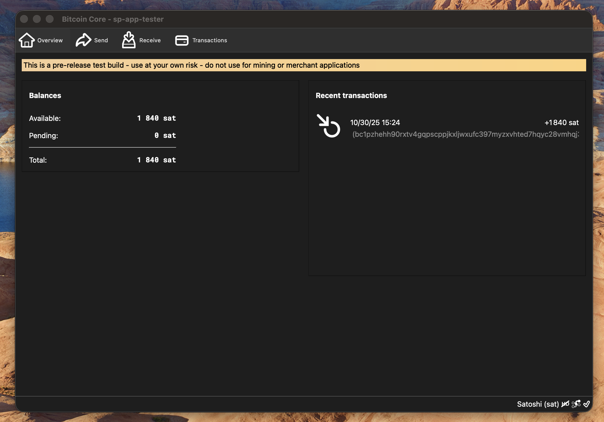
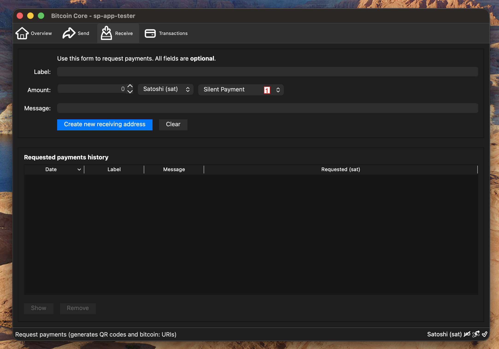
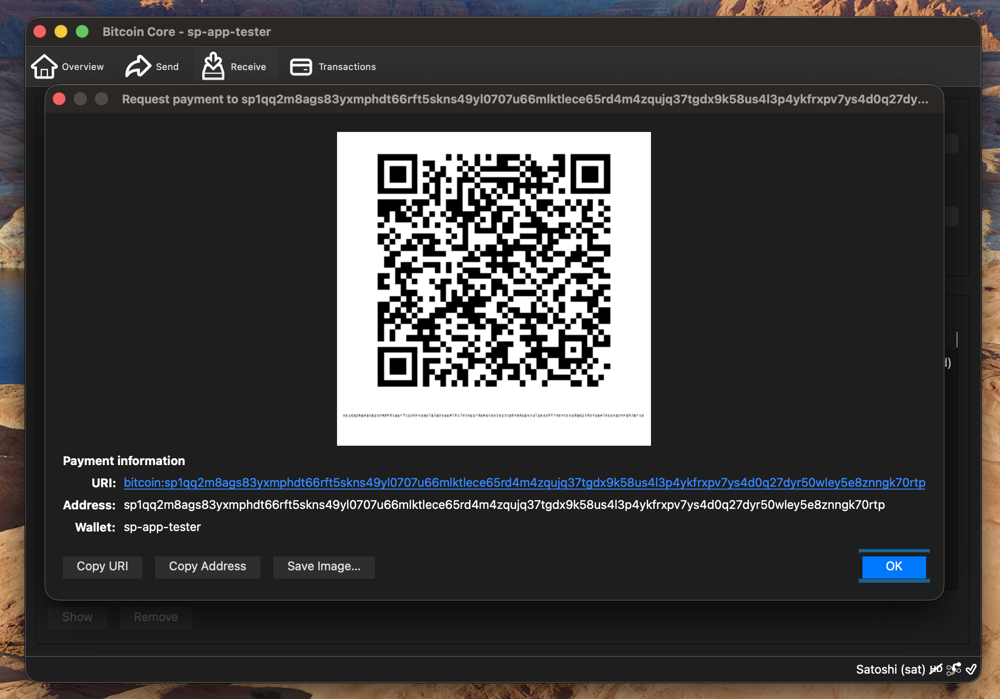
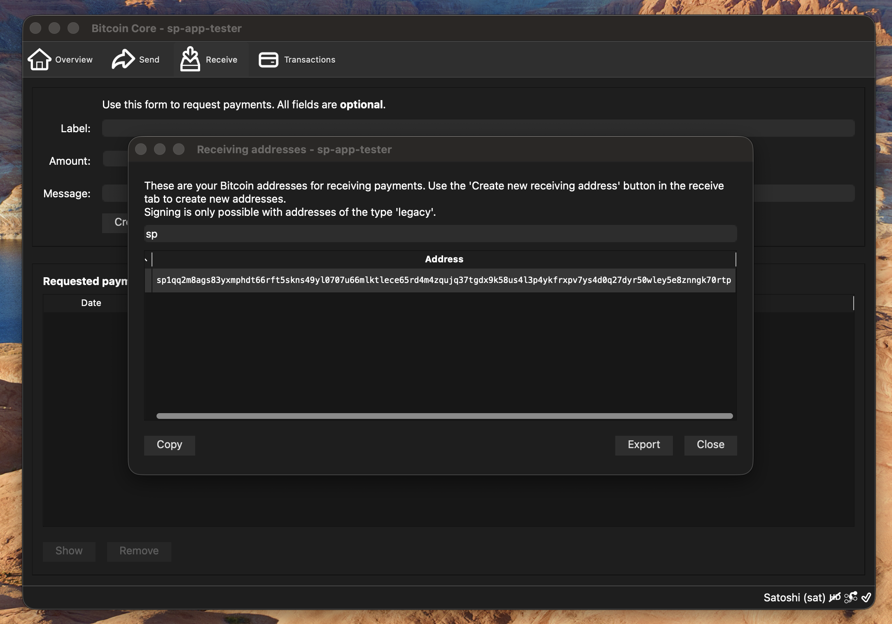

 ***
## Receiving Silent Payments

#### Receive

There are 2 methods for finding the silent payment address in Bitcoin Core

---

#### Make Silent Payment Request

- (1) Choose "Silent Payment" in address type dropdown
- Select "Create new receiving address" to generate requested silent payment history address

**Note:**
> Once the silent payment entry is added to the list you can double-click the entry to re-open the view

---

#### Copy Silent Payment Address

Select "Copy Address" to copy to clipboard

---

#### Find Silent Payment in Receiving Addresses

- Select "Window" in application menu
- Select "Receiving addresses" from menu
- Search for "sp" in the search field
- Select the address with "sp1q" prefix from the Address list
- Select "Copy"

---

