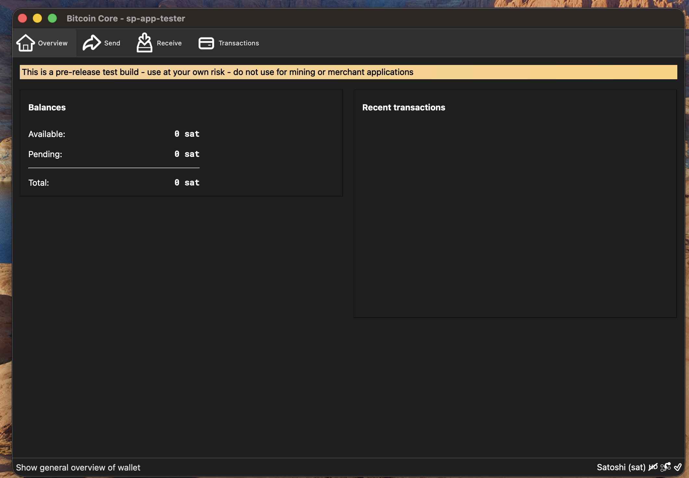
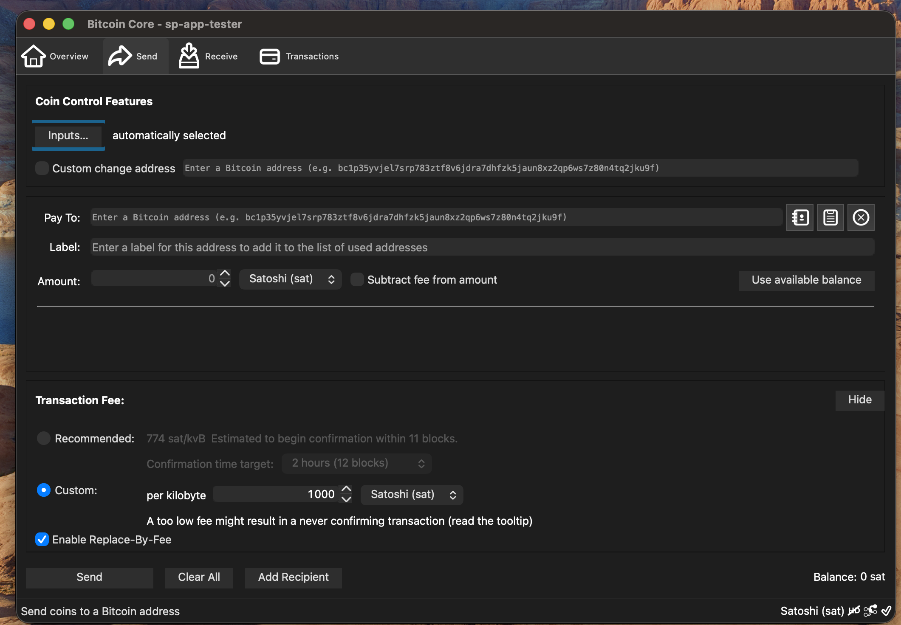

 ***
## Wallet Overview

#### Overview

Main screen showing balance and recent transactions

---

#### Send

Send bitcoin to other wallets

---

#### Receive

- Copy silent payments address to share with others
- Go to [Receiving Silent Payments](#receiving-silent-payments) for more details

**Note:**
> Only one address is required, each transaction will have a unique on chain taproot address

---

#### Transactions

View transaction history

**Note:**
> transactions will appear as soon as they are broadcast to the network

---

