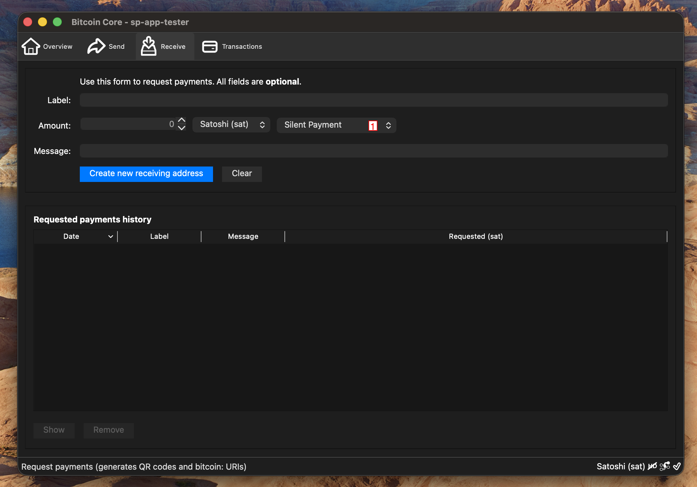
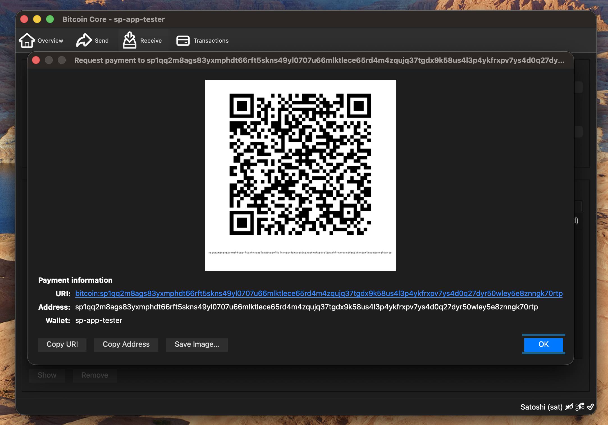
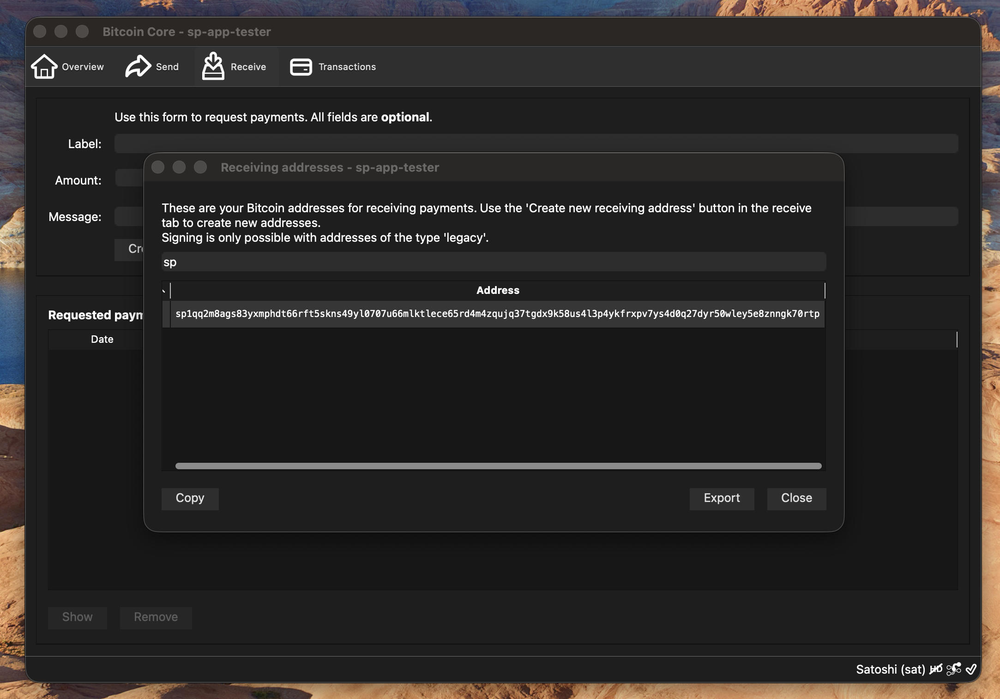

# Bitcoin Core Wallet User Guide

> **Last Updated:** 2025-10-30

Bitcoin Core Wallet with Silent Payments Support

---

## Table of Contents

- [Building from Source](#building-from-source)
- [Initial Wallet Setup](#initial-wallet-setup)
- [Wallet Overview](#wallet-overview)
- [Sending Silent Payments](#sending-silent-payments)
- [Receiving Silent Payments](#receiving-silent-payments)
- [Troubleshooting](#troubleshooting)

---

## Building from Source

**Source Code:** https://github.com/Eunovo/bitcoin/tree/2025-implement-bip352-receiving

### Prerequisites
- Xcode Command Line Tools
- Qt6 - `brew install qt`

### Build Steps (Simplified) - Detailed [MacOS Reference](https://github.com/bitcoin/bitcoin/blob/master/doc/build-osx.md)
```bash
export QTDIR=/usr/local/opt/qt
git clone https://github.com/Eunovo/bitcoin
cd bitcoin
git checkout -B 2025-implement-bip352-receiving origin/2025-implement-bip352-receiving
cmake -B build -DBUILD_GUI=ON
cmake --build build -j 10 --target deploy
# You will need a synchronized full node to continue
./build/dist/Bitcoin-Qt.app/Contents/MacOS/Bitcoin-Qt -datadir=/Users/<user>/data/bitcoin -conf=/Users/<user>/.bitcoin/bitcoin.conf -server
```


---

 ***
## Initial Wallet Setup

Create and configure your wallet for silent payments

#### Create New Wallet

- Enter "Wallet Name"
- Check "Make Silent Payments Wallet"
- Select "Create" button


---


 ***
## Wallet Overview


#### Overview

Main screen showing balance and recent transactions


---

#### Send

Send bitcoin to other wallets


---

#### Receive

- Copy silent payments address to share with others
- Go to [Receiving Silent Payments](#receiving-silent-payments) for more details


**Note:**
> Only one address is required, each transaction will have a unique on chain taproot address

---

#### Transactions

View transaction history


**Note:**
> transactions will appear as soon as they are broadcast to the network

---


 ***
## Sending Silent Payments


#### Enter Recipient Information

- Enter "Pay To"
- Enter "Amount"
- Select "Send"


**Note:**
> Currently Bitcoin Core does not support Human Readable Names (HRN) addresses

---

#### Confirm Transaction

- Review recipient information
- Select "Send" to broadcast transaction


---


 ***
## Receiving Silent Payments


#### Receive

There are 2 methods for finding the silent payment address in Bitcoin Core


---

#### Make Silent Payment Request

- (1) Choose "Silent Payment" in address type dropdown
- Select "Create new receiving address" to generate requested silent payment history address




**Note:**
> Once the silent payment entry is added to the list you can double-click the entry to re-open the view

---

#### Copy Silent Payment Address

Select "Copy Address" to copy to clipboard




---

#### Find Silent Payment in Receiving Addresses

- Select "Window" in application menu
- Select "Receiving addresses" from menu
- Search for "sp" in the search field
- Select the address with "sp1q" prefix from the Address list
- Select "Copy"




---


## Troubleshooting

### Common Issues

**Wallet won't start:**
- Check that you have the required dependencies installed
- Verify the application path is correct

**Screenshots don't match:**
- Ensure you're using the correct version
- Check that you compiled from the correct branch


### Need More Help?

- Report an issue in the project repository: https://github.com/Eunovo/bitcoin/tree/2025-implement-bip352-receiving
- Join Silent Payments [discord](https://discord.gg/UFF2u6hxBf) and ask for help

---

*This guide is maintained automatically. If you notice any discrepancies, please report them.*