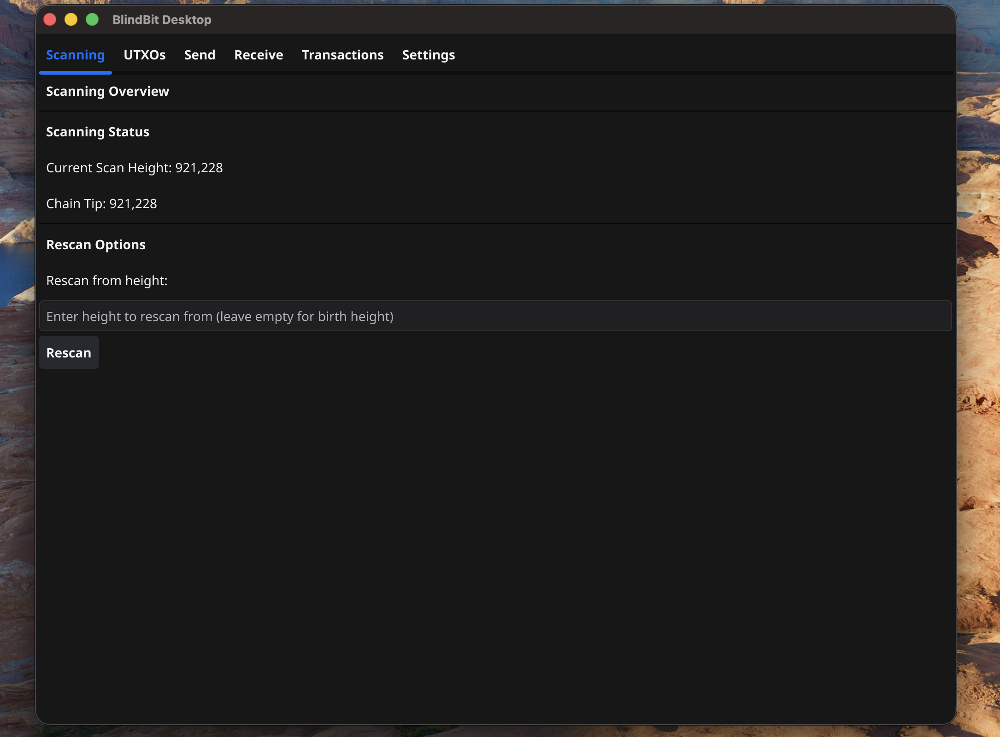
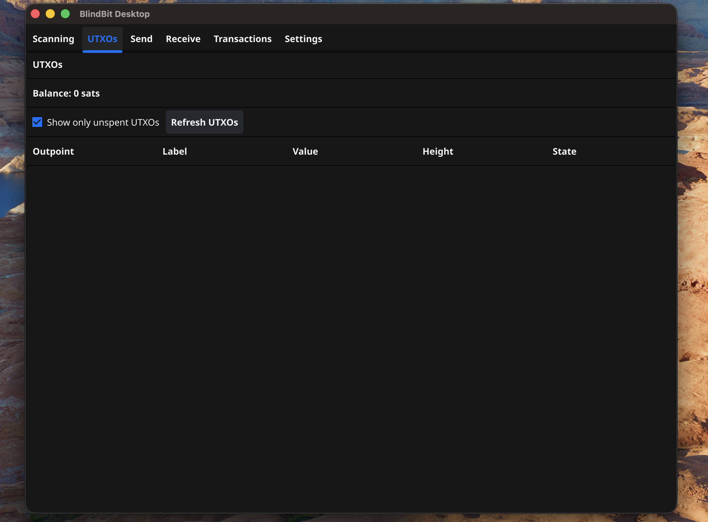
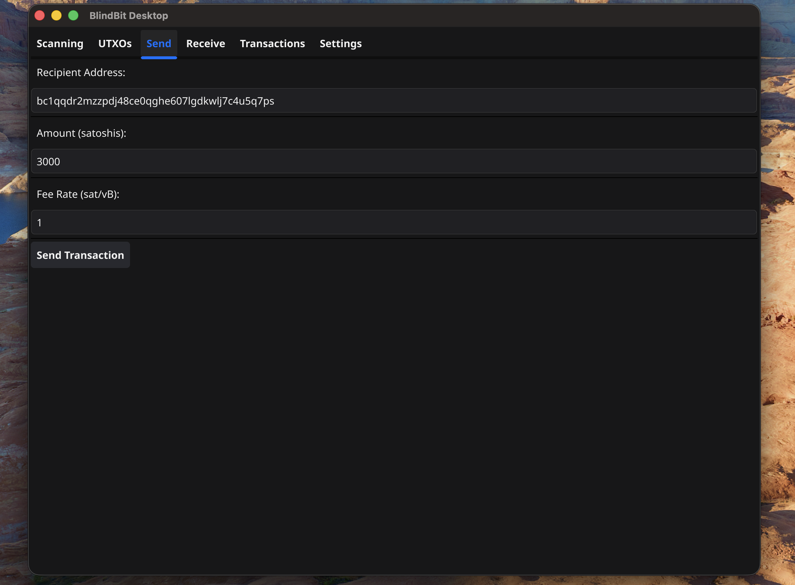
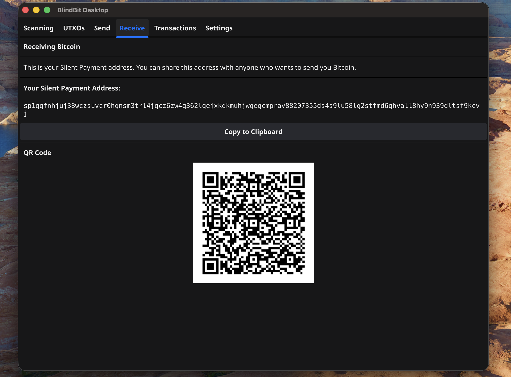
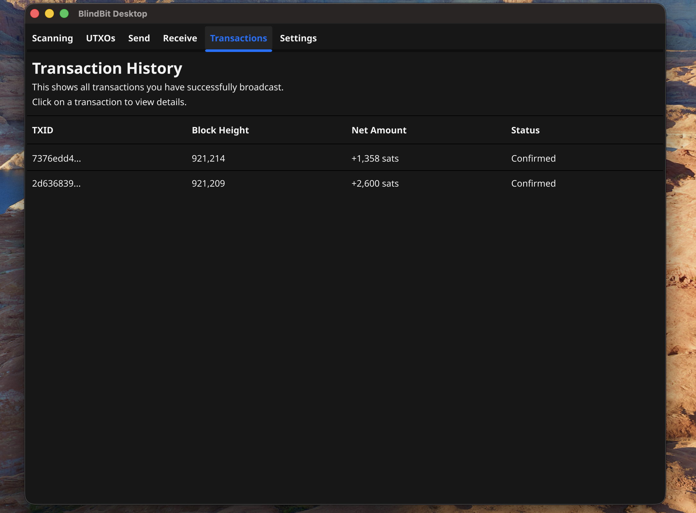
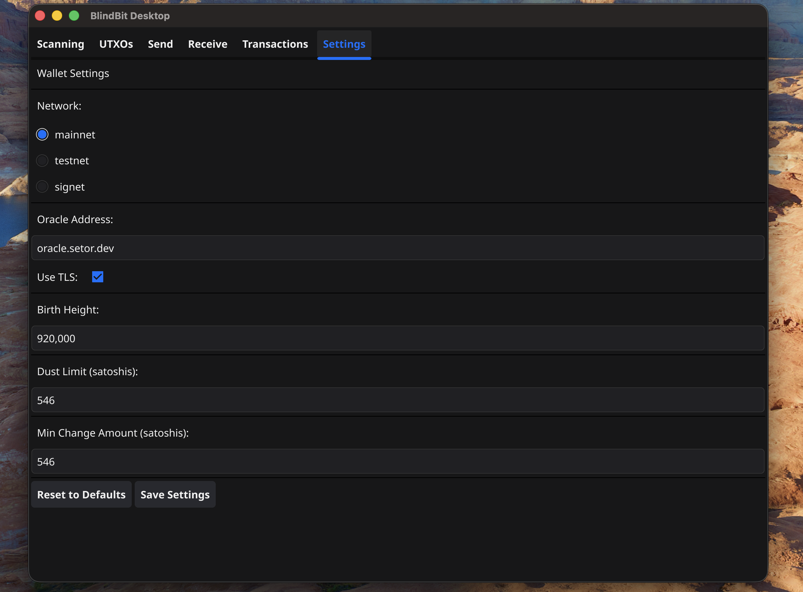

 ***
## Using BlindBit Desktop

Overview of wallet and navigation

#### Scanning

View blockchain scanning progress

**Note:**
> "Current Scan Height": \# will match "Chain Tip" when sync is complete
> 
> **Rescan Button**: only use this button after changing "birth height" in settings or testing
> 

---

#### UTXOs

View wallet balance and unspent transaction outputs

**Note:**
> Toggle the "Show only unspent UTXOs" to view spent too
> 

---

#### Send

Send bitcoin to other wallets

**Note:**
> Fee Rate must be greater than or equal to 1 sat/vB
> 

---

#### Receive

Copy silent payments address to share with others

**Note:**
> Only one address is required, each transaction will have a unique on chain taproot address

---

#### Transactions

View transaction history

**Note:**
> received transactions will only appear once the transaction is confirmed in a block
> 
> spending transactions will appear immediately
> 
> fees will only appear if spent from this wallet - not available after recovery
> 

---

#### Settings

Modify wallet settings and configuration

**Note:**
> restart may be required after applying new settings

---

