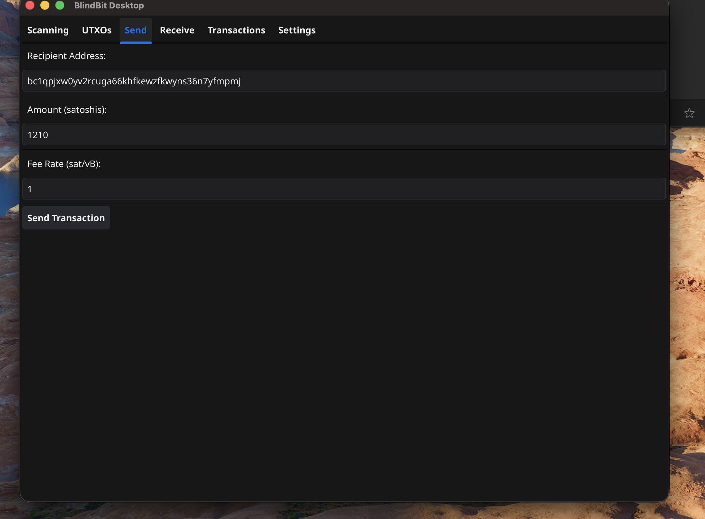
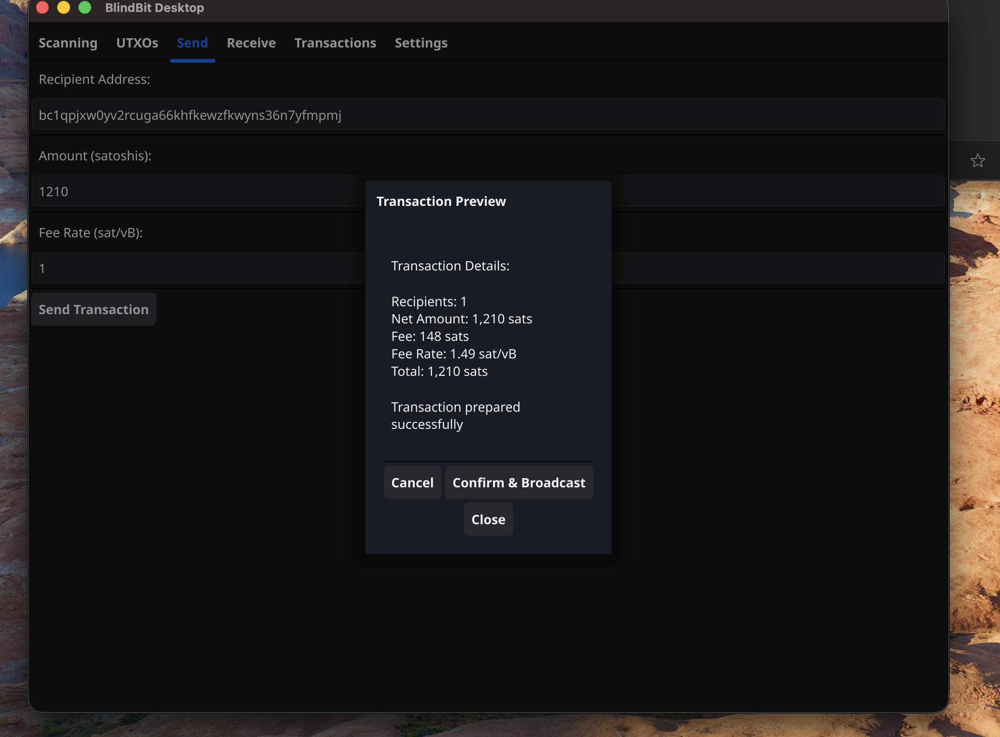
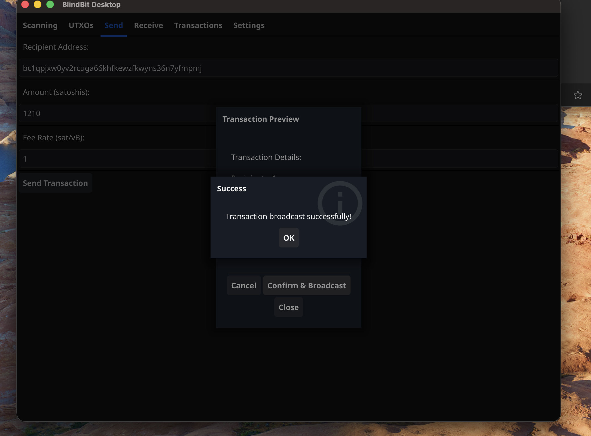
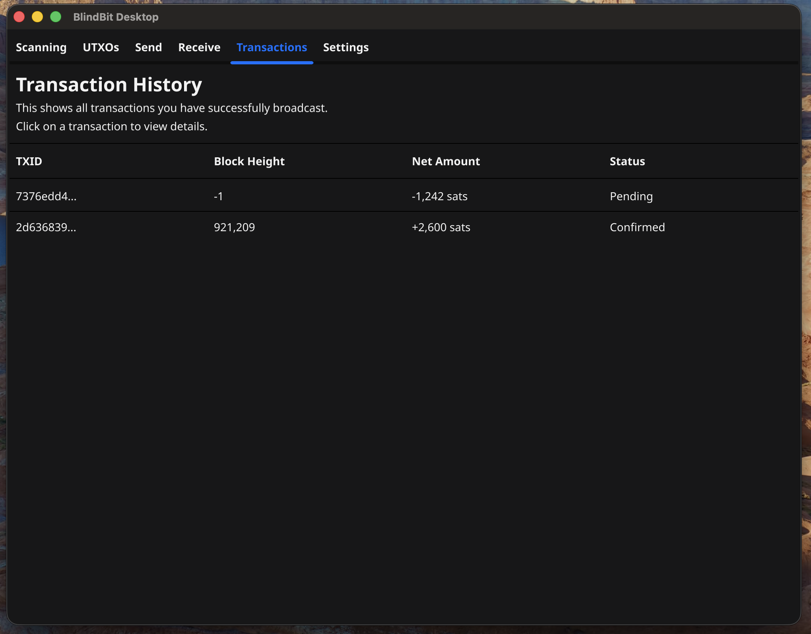
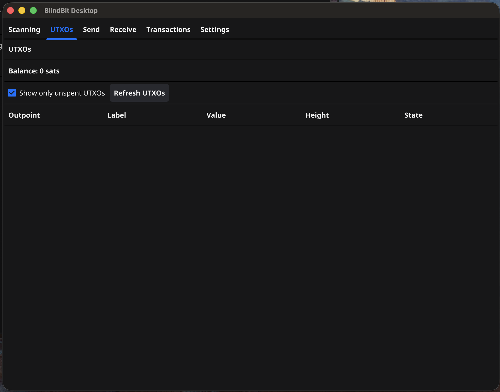

 ***
## Sending Transactions

Highlight the basics of sending a payment from blindbit-desktop

#### Enter Recipient Information

- Enter a recipient address, the amount to send, fee rate
- Select "Send Transaction" to view details

**Note:**
> Currently blindbit-desktop does not support coin selection or Human Readable Names (HRN) addresses
> 
> Fee rate will be increased to spend remaining UTXO to avoid dust
> 

---

#### Preview Transaction

Select "Confirm & Broadcast" to send the transaction

**Note:**
> Select "Close" to return to the previous view and make changes

---

#### Transaction Confirmation

Click "OK" to close broadcast response

---

#### Pending Transactions

Unconfirmed transactions will have a "Pending" status

**Note:**
> Select a "transaction" to view details

---

#### Spent UTXOs

While a transaction is being confirmed the whole UTXO is treated as spent

**Note:**
> Toggle "unspent" to view unconfirmed_status

---

