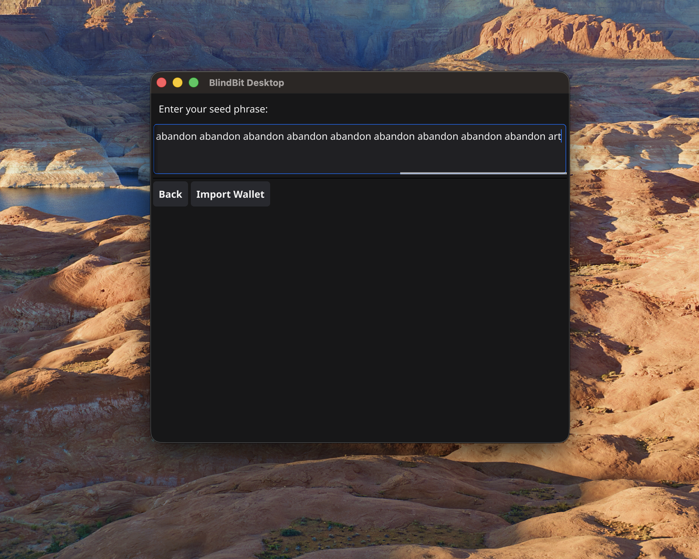
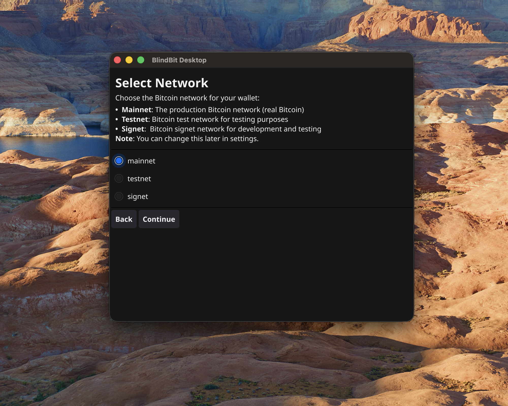
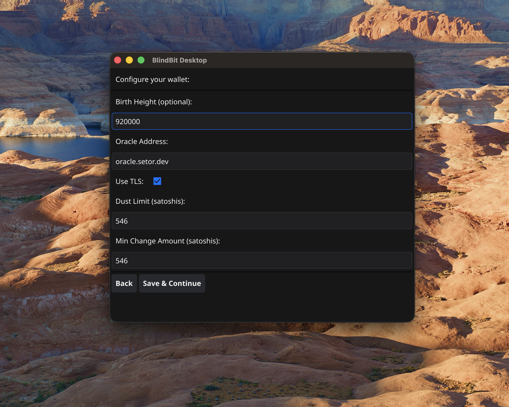
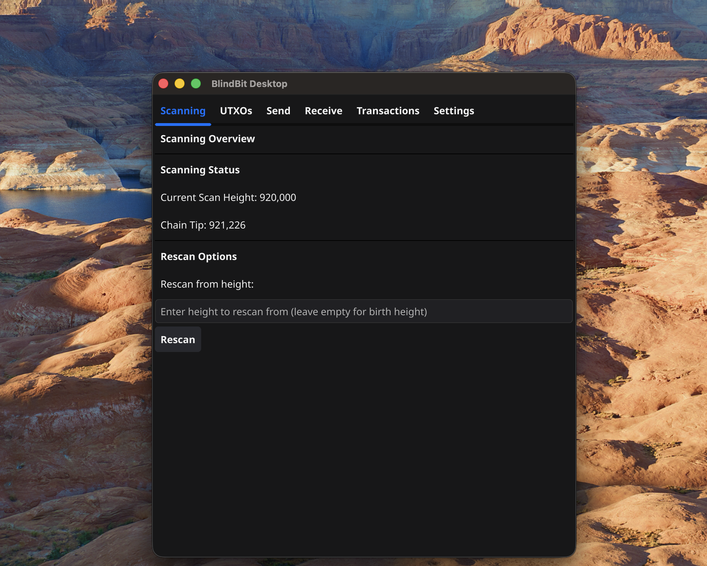

 ***
## Initial Wallet Setup

This workflow demonstrates how to recover a silent payments wallet from seed phrase

#### Import Existing Wallet

Select "Import Existing Wallet" to restore wallet from seed phrase

---

#### Finalize Import Wallet

- Enter seed phrase
- Select "Import Wallet"

**Note:**
> 12 or 24 word mnemonic supported

---

#### Make Network Selection

- Choose "mainnet" for production use
- Select "Continue" to confirm network

---

#### Finalize Wallet Setup

- Choose a "block height" to capture any previous silent payment transactions for this wallet
- Select "Save & Continue" to complete setup and start scanning for transactions

**Note:**
> wallet.dat is stored in ~/.blindbit-desktop by default
> 
> **Warning:** key material in this file is not encrypted at this time
> 

---

#### Scanning

Monitor "Scanning Status" on this view

---

