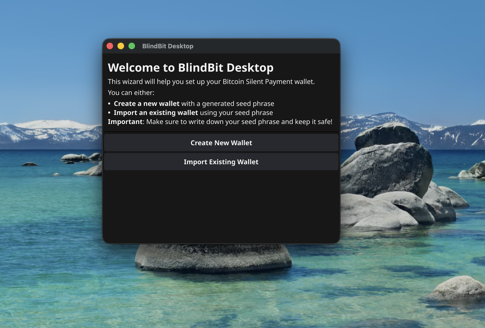
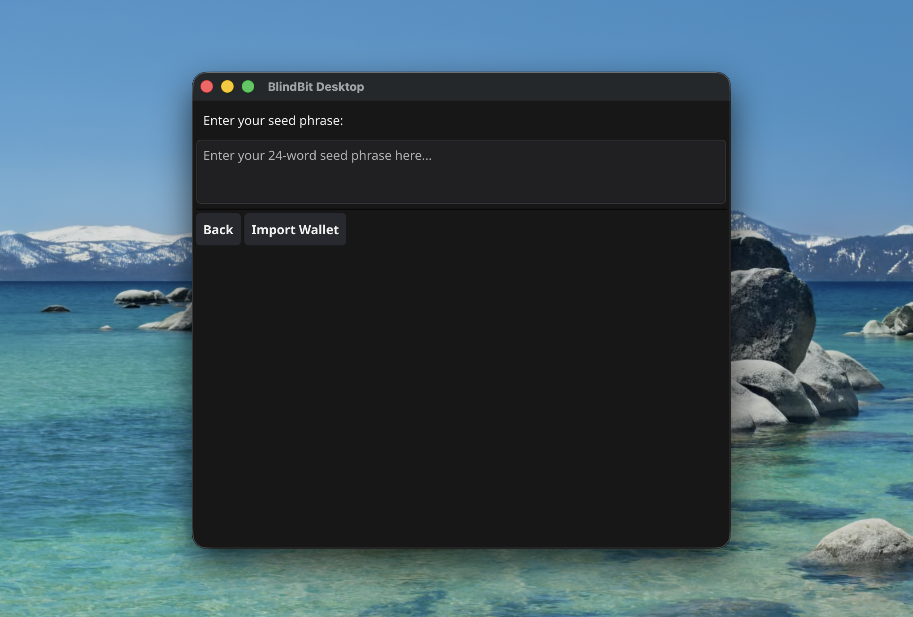
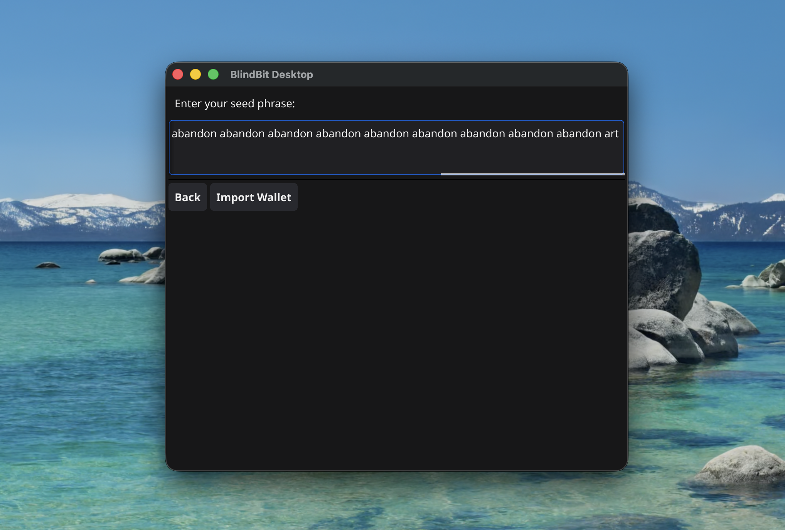
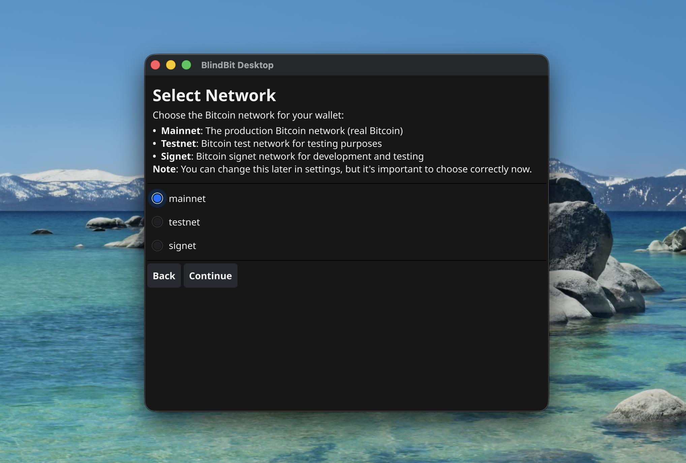
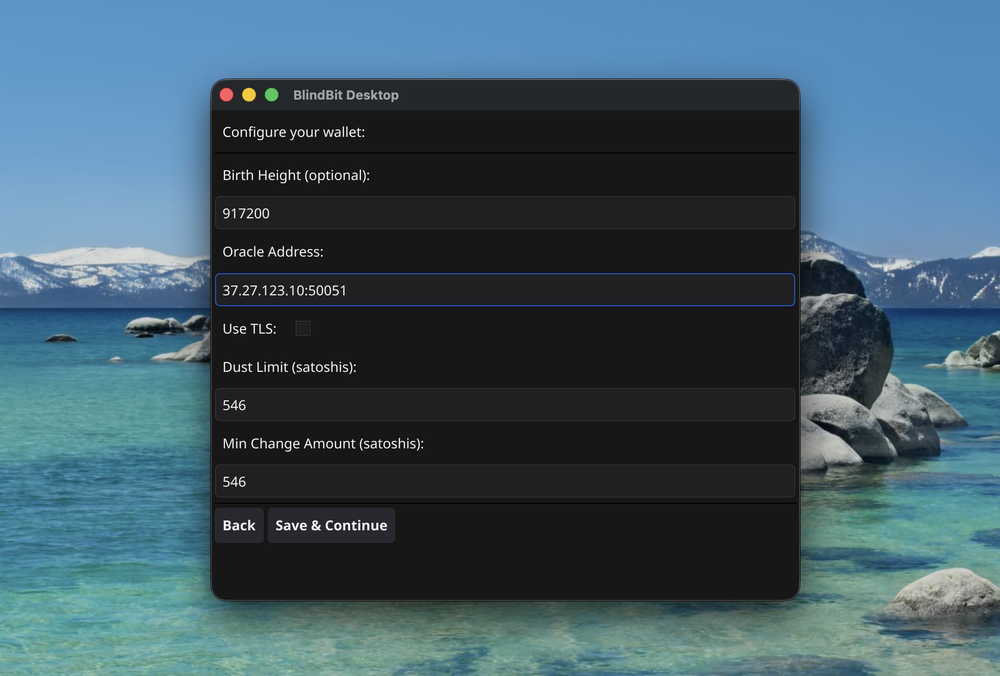

# BlindBit Desktop Setup Guide

> **Last Updated:** 2025-10-27

Step-by-step guide to setting up BlindBit Desktop wallet

---

## Table of Contents

- [Prerequisites](#prerequisites)
- [Setup Steps](#setup-steps)
- [Building from Source](#building-from-source)
- [Troubleshooting](#troubleshooting)

---

## Prerequisites

Before you begin, ensure you have:

- **Operating System:** macOS, Linux, or Windows
- **Disk Space:** At least 500 MB free
- **Internet Connection:** Required for blockchain synchronization
- **Bitcoin Knowledge:** Basic understanding of cryptocurrency wallets

---

## Setup Steps

This guide will walk you through 20 steps to set up BlindBit Desktop.

### Step 1: Clone repo

build golang wallet
            % git clone https://github.com/setavenger/blindbit-desktop.git
            

---

### Step 2: Compile BlindBit Desktop

build golang wallet
            % go build -o blindbit-desktop ./cmd/blindbit-desktop
            

---

### Step 3: Create Wallet

Select Create New Wallet to generate a seed phase

---

### Step 4: Create Wallet

Select Import Existing Wallet

---

### Step 5: Focus Seed Phrase

---

### Step 6: Import Seed Phrase

Enter seed phase

---

### Step 7: Import Wallet

TODO: Describe what this does

---

### Step 8: Select Network

TODO: Describe what this does

---

### Step 9: Finalize

TODO: Describe what this does

---

### Step 10: Setup wallet birthdate

TODO: Describe what this does

---

### Step 11: Define birth height

TODO: Describe what this does

---

### Step 12: Define oracle address

TODO: Describe what this does

---

### Step 13: Enter tweak server

Blindbit Oracle V2

---

### Step 14: Finalize

Start scan

---

### Step 15: Scanning

TODO: Describe what this does

---

### Step 16: Settings

TODO: Describe what this does

---

### Step 17: Receive Tab

TODO: Describe what this does

---

### Step 18: Transactions Tab

TODO: Describe what this does

---

### Step 19: Send Tab

TODO: Describe what this does

---

### Step 20: Utxos Tab

TODO: Describe what this does

---

## Building from Source

**Source Code:** https://github.com/blindbit/blindbit-desktop

# Building from source

1. Clone the repository
2. Install Go dependencies
3. Run build command

---

## Troubleshooting

### Application Won't Launch

- Verify the application is installed correctly
- Check system requirements
- Try restarting your computer

### Screenshots Don't Match

- Ensure you're using the correct version of BlindBit Desktop
- UI may vary slightly between operating systems
- Check for available updates

### Sync Issues

- Verify your internet connection
- Check firewall settings
- Allow sufficient time for blockchain synchronization

### Need More Help?

- Visit the project repository: https://github.com/blindbit/blindbit-desktop
- Search for existing issues in the community forums
- Contact the BlindBit Desktop support team

---

**Documentation generated by Bitcoin Wallet Documentation Pipeline**

*This guide is maintained automatically. If you notice any discrepancies, please report them.*