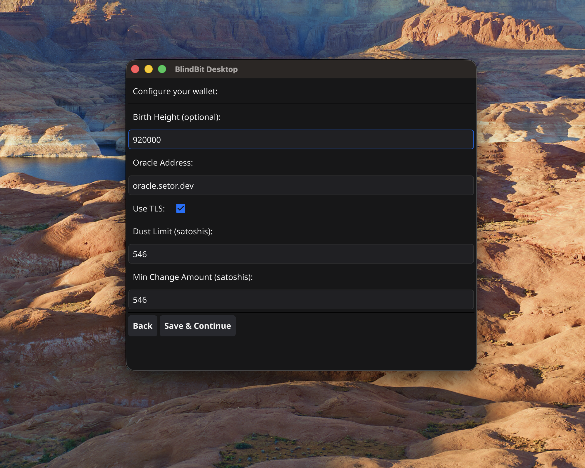
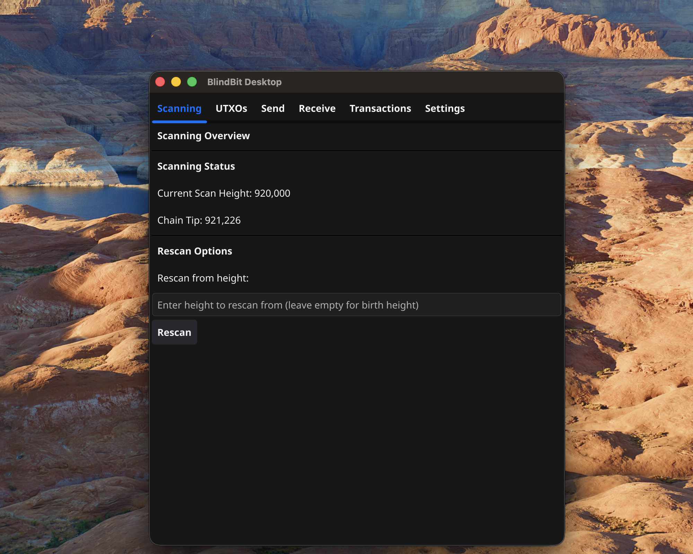
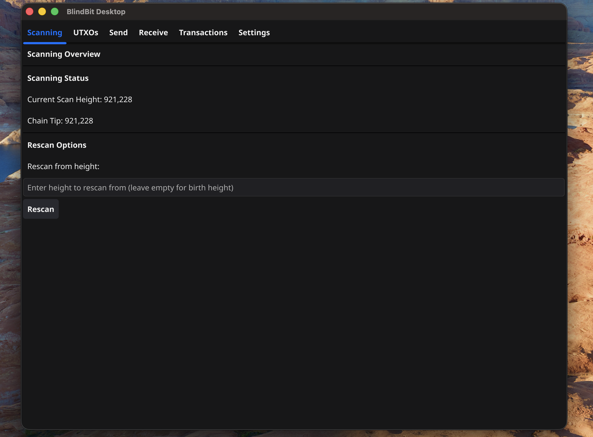
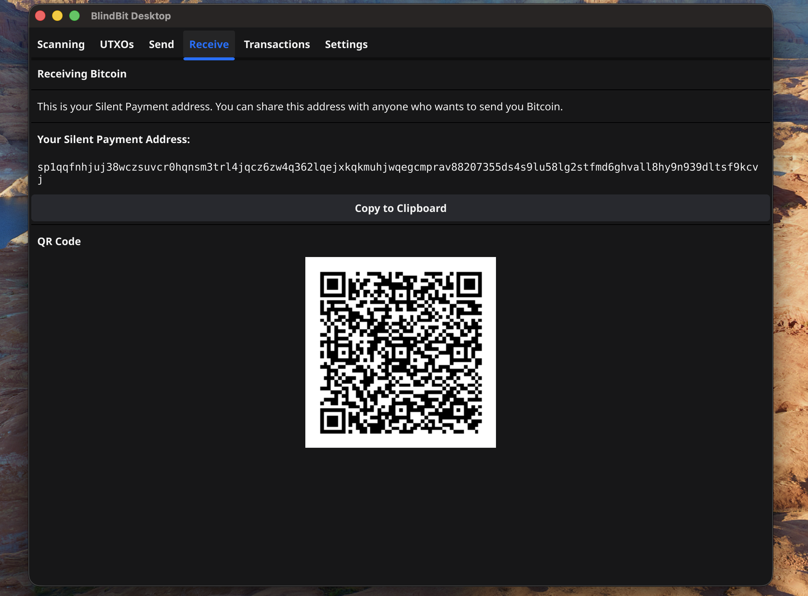
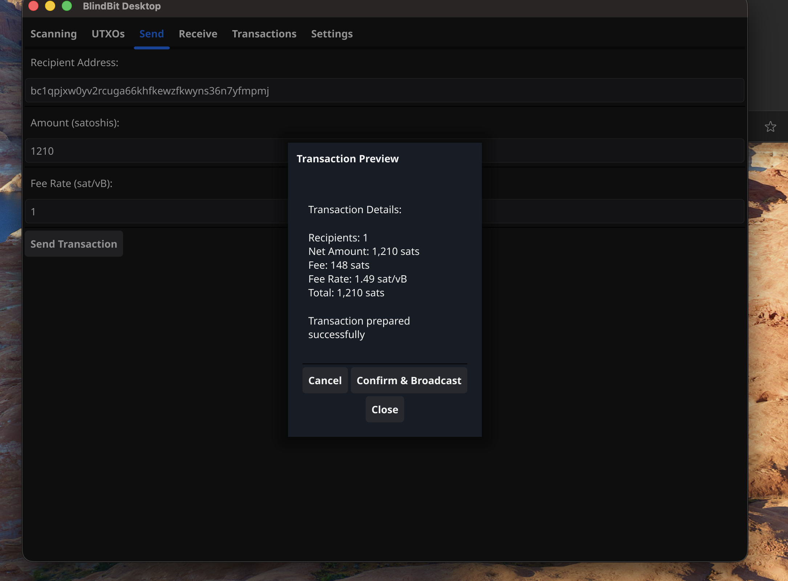

# BlindBit Desktop User Guide

> **Last Updated:** 2025-10-29

Step-by-step guide to setting up and using BlindBit Desktop wallet

---

## Table of Contents

- [Building from Source](#building-from-source)
- [Initial Wallet Setup](#initial-wallet-setup)
- [Using BlindBit Desktop](#using-blindbit-desktop)
- [Sending Transactions](#sending-transactions)
- [Receiving Transactions](#receiving-transactions)
- [Troubleshooting](#troubleshooting)

---

## Building from Source

**Source Code:** https://github.com/setavenger/blindbit-desktop

Instructions for compiling BlindBit Desktop from [source](https://github.com/setavenger/blindbit-desktop?tab=readme-ov-file#prerequisites)
Quick Start
1. Verify Go version 1.24 or later
```
go version
```
2. Compile blindbit-desktop
```
cd blindbit-desktop
git checkout -B alpha origin/alpha
go build -o blindbit-desktop ./cmd/blindbit-desktop
./blindbit-desktop
```

---

 ***
## Initial Wallet Setup

This workflow demonstrates how to recover a silent payments wallet from seed phrase

#### Import Existing Wallet

Select "Import Existing Wallet" to restore wallet from seed phrase


---

#### Finalize Import Wallet

- Enter seed phrase
- Select "Import Wallet"


**Note:**
> 12 or 24 word mnemonic supported

---

#### Make Network Selection

- Choose "mainnet" for production use
- Select "Continue" to confirm network


---

#### Finalize Wallet Setup

- Choose a "block height" to capture any previous silent payment transactions for this wallet
- Select "Save & Continue" to complete setup and start scanning for transactions




**Note:**
> wallet.dat is stored in ~/.blindbit-desktop by default
> 
> **Warning:** key material in this file is not encrypted at this time
> 

---

#### Scanning

Monitor "Scanning Status" on this view




---


 ***
## Using BlindBit Desktop

Overview of wallet and navigation

#### Scanning

View blockchain scanning progress




**Note:**
> "Current Scan Height": \# will match "Chain Tip" when sync is complete
> 
> **Rescan Button**: only use this button after changing "birth height" in settings or testing
> 

---

#### UTXOs

View wallet balance and unspent transaction outputs


**Note:**
> Toggle the "Show only unspent UTXOs" to view spent too
> 

---

#### Send

Send bitcoin to other wallets


**Note:**
> Fee Rate must be greater than or equal to 1 sat/vB
> 

---

#### Receive

Generate addresses to receive payments




---

#### Transactions

View transaction history


**Note:**
> received transactions will only appear once the transaction is confirmed in a block
> 
> spending transactions will appear immediately
> 
> fees will only appear if spent from this wallet - not available after recovery
> 

---

#### Settings

Modify wallet settings and configuration


**Note:**
> restart may be required after applying new settings

---


 ***
## Sending Transactions

Highlight the basics of sending a payment from blindbit-desktop

#### Enter Recipient Information

- Enter a recipient address, the amount to send, fee rate
- Select "Send Transaction" to view details


**Note:**
> Currently blindbit-desktop does not support coin selection or Human Readable Names (HRN) addresses at this time
> 
> Fee rate will be increased to spend remaining UTXO to avoid dust
> 

---

#### Preview Transaction

Select "Confirm & Broadcast" to send the transaction




**Note:**
> Select "Close" to return to the previous view and make changes

---

#### Transaction Confirmation

Click "OK" to close broadcast response


---

#### Pending Transactions

Unconfirmed transactions will have a "Pending" status


**Note:**
> Select a "transaction" to view details

---

#### Spent UTXOs

While a transaction is being confirmed the whole UTXO is treated as spent


**Note:**
> Toggle "unspent" to view unconfirmed_status

---


 ***
## Receiving Transactions

Overview of receiving funds to blindbit-desktop

#### UTXOs

UTXOs will appear here automatically after confirmation


---

#### Transactions

- History of wallet transactions
- Select a "transaction" to view details


**Note:**
> received transactions will appear here automatically when confirmed
> 

---


## Troubleshooting

### Screenshots Don't Match
- Verify the wallet was compiled from the correct branch "alpha"

### Sync Issues
- Verify your internet connection
- Check firewall settings
- Allow sufficient time for blockchain synchronization


### Need More Help?

- Report an issue in the project repository: https://github.com/setavenger/blindbit-desktop
- Join Silent Payments [discord](https://discord.gg/UFF2u6hxBf) and ask for help

---

*This guide is maintained automatically. If you notice any discrepancies, please report them.*