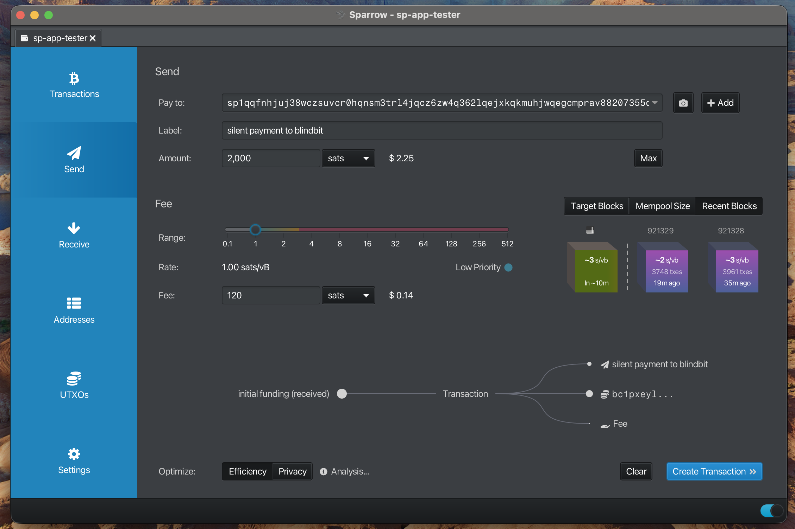
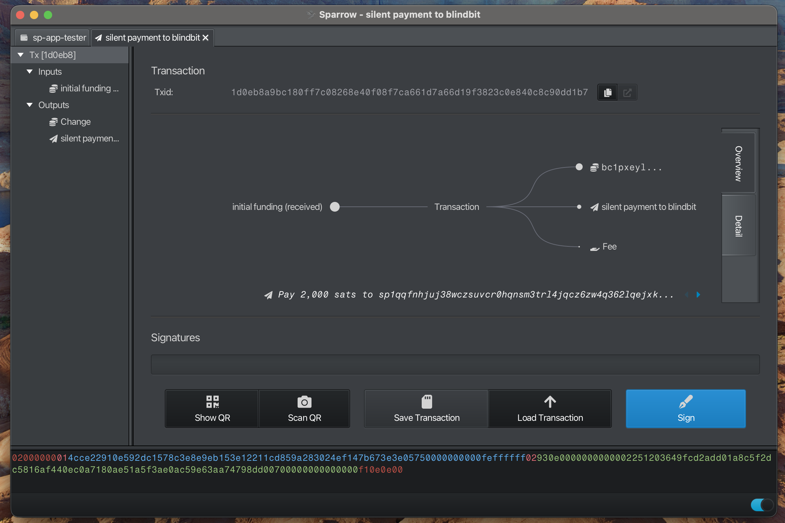
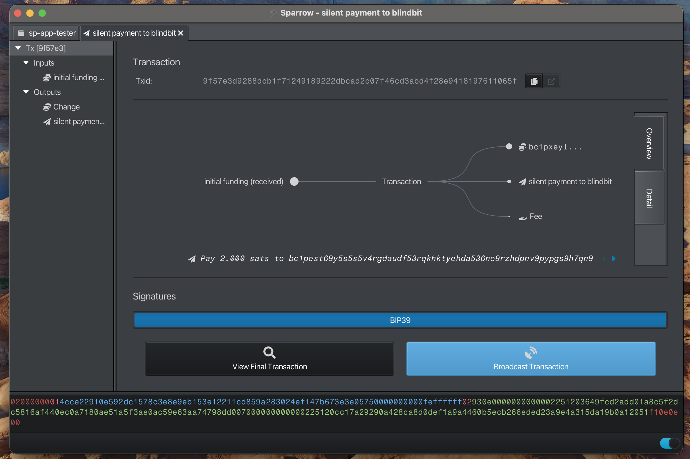

 ***
## Send to address

Highlight the process for sending a payment to a silent payment address

#### Enter Recipient Information

- Enter "Pay to"
- Enter "Label"
- Enter "Amount"
- Select "Send Transaction" to view details

**Note:**
> Human Readable Names (HRN) or silent payment addresses are supported
> 

---

#### Finalize Transaction

**Note:**
> "Pay to" displays the silent payment address

---

#### Sign Transaction

---

#### Broadcast Transaction

---

