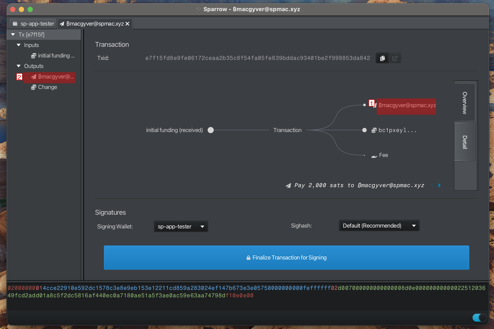

 ***
## Send to contact

Highlight the process for sending a payment to a contact

#### Enter Recipient Information

- Enter Human-readable Contact as "Pay to"
- Enter "Amount"
- Select "Send Transaction" to view details

**Note:**
> "Label" will be automatically populated but can be overridden 

---

#### Finalize Transaction

- 1. Hover over the "contact" in the transaction output to see the actual silent payment address
- 2. Select "contact" in Outputs to view the silent payment address

**Note:**
> "Pay to" displays the "contact"

---

#### Sign Transaction

---

#### Broadcast Transaction

---

