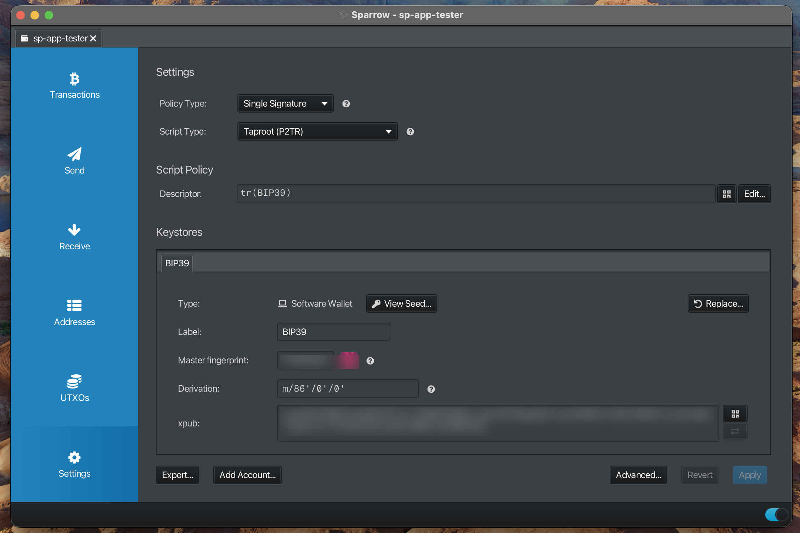

 ***
## Initial Wallet Setup

This workflow demonstrates how to create a wallet for silent payments

#### Create New Wallet

- Create a new wallet using this [guide](https://www.sparrowwallet.com/docs/quick-start.html#creating-your-first-wallet)
- Policy Type: "Single Signature"
- Script Type: "Taproot (P2TR)"
- Derivation: m/86'/0'/0'

**Note:**
> Type: "Software Wallet" required at this time to send silent payments

---

