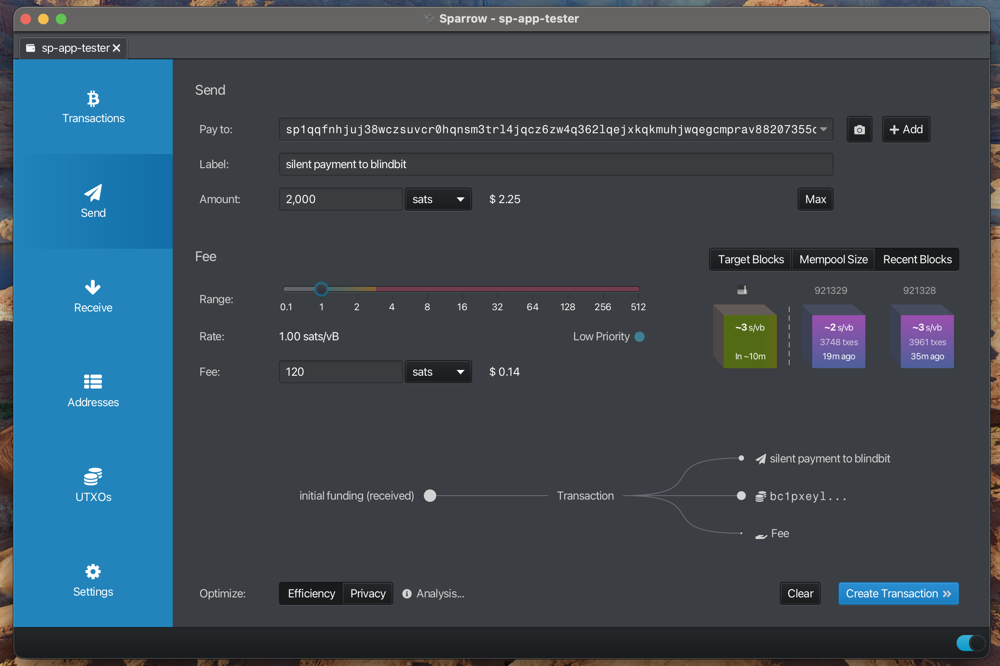
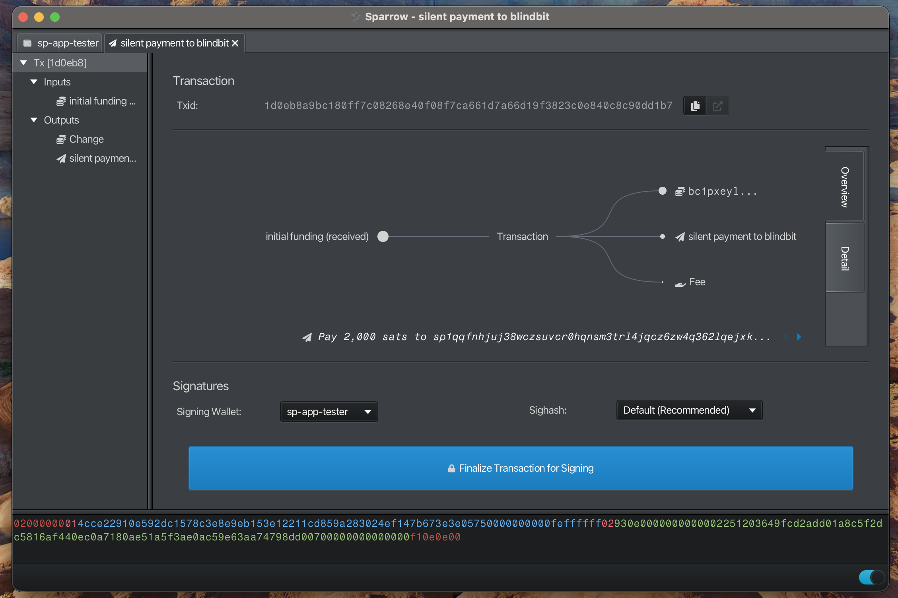
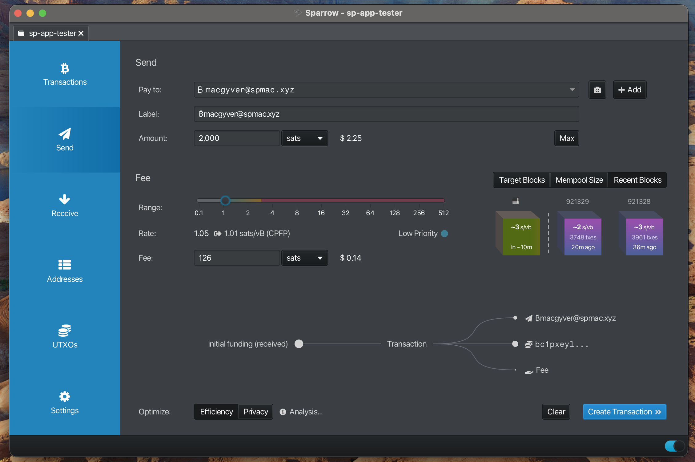

# Sparrow User Guide

> **Last Updated:** 2025-10-29

Step-by-step guide to setting up and using Sparrow wallet with silent payments

---

## Table of Contents

- [Initial Wallet Setup](#initial-wallet-setup)
- [Using Sparrow](#using-sparrow)
- [Sending Transactions](#sending-transactions)
- [Send to contact](#send-to-contact)
- [Troubleshooting](#troubleshooting)

---

 ***
## Initial Wallet Setup

This workflow demonstrates how to create a wallet for silent payments

#### Create New Wallet

- Create a new wallet using this [guide](https://www.sparrowwallet.com/docs/quick-start.html#creating-your-first-wallet)
- Policy Type: "Single Signature"
- Script Type: "Taproot (P2TR)"
- Derivation: m/86'/0'/0'

**Note:**
> Type: "Software Wallet" required at this time to send silent payments

---

 ***
## Using Sparrow

Overview of wallet and navigation

#### Transactions

View wallet balance and transaction history

---

#### Send

Send bitcoin to other wallets

---

 ***
## Sending Transactions

Highlight the process for sending a payment to a silent payment address

#### Enter Recipient Information

- Enter "Pay to"
- Enter "Label"
- Enter "Amount"
- Select "Send Transaction" to view details

**Note:**
> Human Readable Names (HRN) or silent payment addresses are supported
> 

---

#### Finalize Transaction

**Note:**
> "Pay to" displays the silent payment address

---

#### Sign Transaction

---

#### Broadcast Transaction

---

 ***
## Send to contact

Highlight the process for sending a payment to a contact

#### Enter Recipient Information

- Enter Human-readable Contact as "Pay to"
- Enter "Amount"
- Select "Send Transaction" to view details

**Note:**
> "Label" will be automatically populated but can be overridden 

---

#### Finalize Transaction

- 1. Hover over the "contact" in the transaction output to see the actual silent payment address
- 2. Select "contact" in Outputs to view the silent payment address

**Note:**
> "Pay to" displays the "contact"

---

#### Sign Transaction

---

#### Broadcast Transaction

---

## Troubleshooting

### Screenshots Don't Match
- Sparrow version 2.3.0+ required

### Sync Issues
- Verify your internet connection
- Check firewall settings
- Allow sufficient time for blockchain synchronization

### Need More Help?

- Report an issue in the project repository: https://github.com/sparrowwallet/sparrow
- Join Silent Payments [discord](https://discord.gg/UFF2u6hxBf) and ask for help

---

*This guide is maintained automatically. If you notice any discrepancies, please report them.*